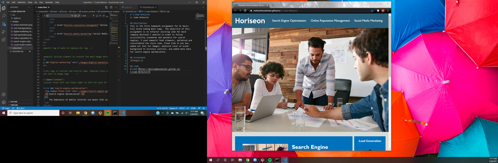

# 1-Code-Refactor
1: Code Refactor

## Description:
This is the first homework assignment for UC Davis Full Stack Coding Boot Camp.  The objective of this assignment is to refactor existing code for mock company Horiseon's website in order to follow accessibility standards and optimize for search engines. I used semantic html elements, optimized and consolidated the style code, fixed link in nav bar, added alt text for images, adjusted color of aside background to increase contrast, and added meta data for search engine optimization.  

## Screenshot

## Link
 https://melinamboedecker.github.io/1-Code-Refactor/
